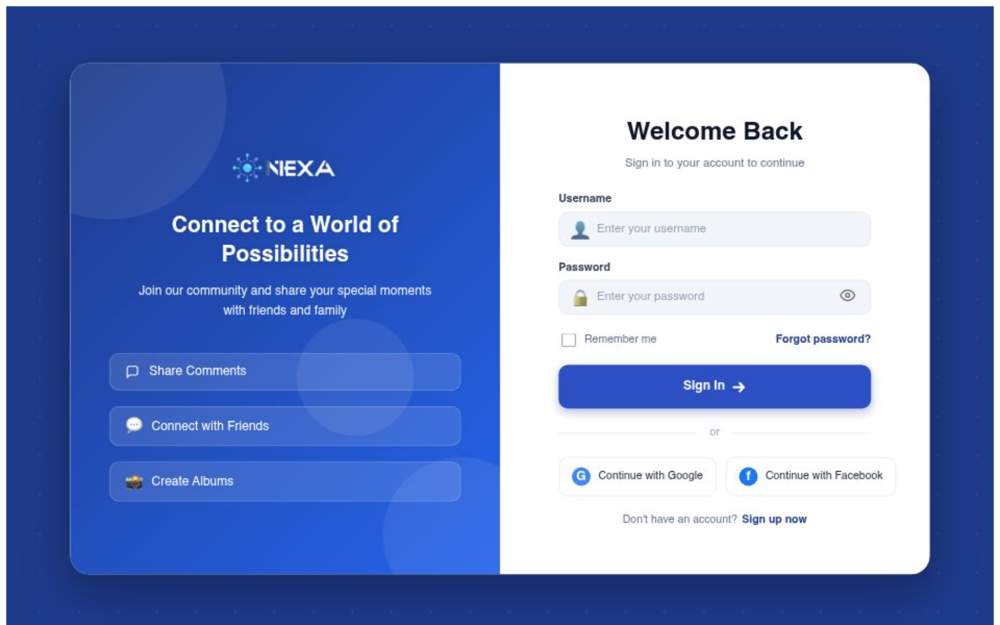
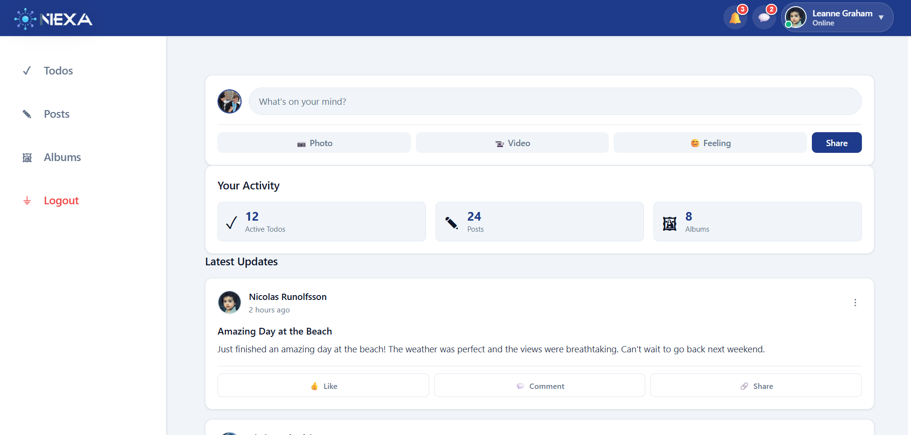
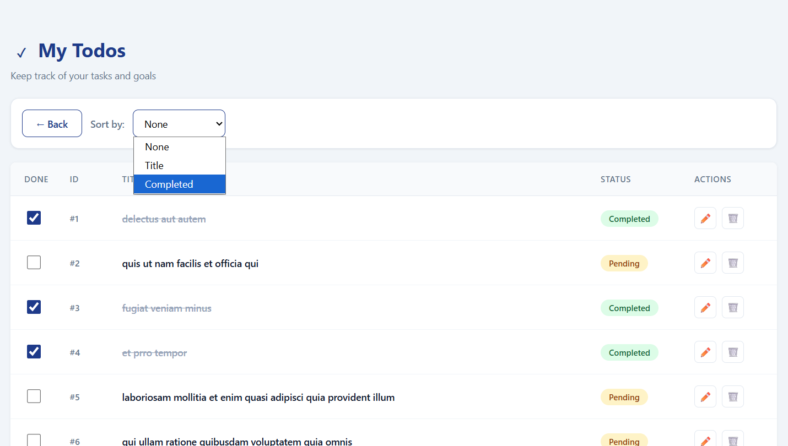
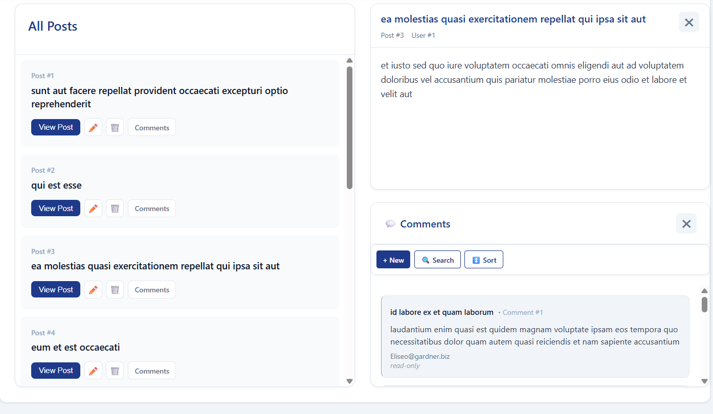
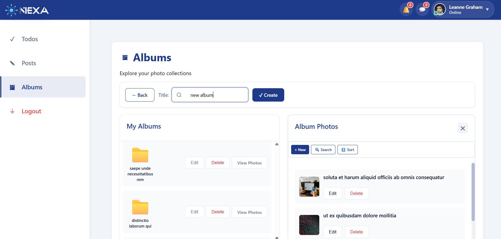

# NEXA – Full-Stack Cloud-Based Social Platform

## Overview

NEXA is a production-style full-stack web application built with React, Node.js, Express, and MySQL.

The platform simulates a modern social-content management system where authenticated users can manage todos, posts, comments, albums, and photos through a scalable RESTful architecture.

Unlike the previous mock-based implementation, the current version uses a real MySQL cloud database hosted on Aiven, providing persistent data storage and a more realistic backend infrastructure.

The project demonstrates frontend architecture, backend engineering, relational database design, API development, authentication workflows, and cloud deployment practices.

---

## Live Deployment

### Frontend

https://nexa-fullstack-dashboard.vercel.app/

### Backend API

https://nexa-fullstack-dashboard.onrender.com

### Database

Cloud-hosted MySQL using Aiven

---

## Screenshots

### Authentication



### Dashboard



### Todos Management



### Posts & Comments



### Albums & Photos



---

## Core Features

- User registration and authentication
- Todos management
- Posts and comments system
- Albums and photos management
- Incremental photo loading
- Nested relational navigation
- Protected routes
- Persistent session management
- Cloud database integration
- Full CRUD functionality

---

## Full-Stack Architecture

User Browser
↓
React Frontend (Vercel)
↓ HTTPS REST API
Express Backend Server
↓
MySQL Cloud Database (Aiven)


---

## Tech Stack

### Frontend

* React
* React Router DOM
* Context API
* Axios
* Vite
* CSS

### Backend

* Node.js
* Express 5
* MySQL
* mysql2
* dotenv
* cors

### Deployment & Infrastructure

* Vercel
* Render
* Aiven Cloud MySQL

---

## Engineering Highlights

* Modular frontend and backend architecture
* RESTful API design
* Real relational database integration
* Separation of concerns across layers
* Reusable custom React hooks
* Context-based global state management
* Query-based filtering and pagination
* Secure parameterized SQL queries
* Environment-based configuration
* Scalable project organization
* Cloud deployment workflow

---

## Repository Structure


project/
│
├── client/   → React frontend
└── server/   → Express + MySQL backend


Additional documentation:

* client/README.md
* server/README.md

---

## Running Locally

### Backend

```bash
cd server
npm install
npm run dev
```

### Frontend

```bash
cd client
npm install
npm run dev
```

Frontend:

```text
http://localhost:5173
```

---

## Environment Variables

### Server

```env
DB_HOST=localhost
DB_USER=your_username
DB_PASSWORD=your_password
DB_NAME=your_database
PORT=5000
```

---

## Future Improvements

* JWT authentication
* Role-based authorization
* Password hashing with bcrypt
* Automated testing
* API documentation with Swagger
* Docker containerization
* Request validation middleware
* Rate limiting
* CI/CD pipelines

---

## Project Purpose

This project was built to demonstrate:

* Full-stack engineering skills
* Real backend development
* Relational database integration
* REST API architecture
* Frontend scalability patterns
* Cloud deployment workflows
* Maintainable software architecture

---

## Author

**Yael Kukis**  
- GitHub: https://github.com/YaelKukis 


